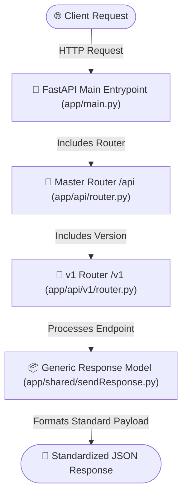

# 💰 Expense Tracker API with Python & FastAPI

[](https://www.python.org/)
[](https://fastapi.tiangolo.com/)
[](https://docs.pydantic.dev/)
[](LICENSE)
[](docs/ARCHITECTURE.md)

A production-ready, clean, and scalable RESTful API built with **Python** and **FastAPI**. Designed around software engineering best practices including environment isolation, hierarchical versioned routing (`/api/v1`), generic response standardization, and automated OpenAPI documentation.

---

## 📚 Table of Contents

- [Features](#-features)
- [Architecture & Data Flow](#-architecture--data-flow)
- [Project Directory Structure](#-project-directory-structure)
- [Standardized API Response](#-standardized-api-response)
- [Quick Start Guide](#-quick-start-guide)
- [Docker Setup](#-docker-setup)
- [Interactive API Documentation](#-interactive-api-documentation)
- [Extended Documentation](#-extended-documentation)
- [Roadmap](#-roadmap)
- [License](#-license)

---

## ✨ Features

- **⚡ High Performance Framework**: Powered by FastAPI and Uvicorn for asynchronous speed and built-in OpenAPI specifications.
- **🔐 Environment Configuration**: Managed by `python-dotenv` in [`app/config.py`](app/config.py), gracefully parsing environment settings from `.env`.
- **🏗️ Modular Package Hierarchy**: Structured python package layout with explicit `__init__.py` markers across sub-modules (`api`, `v1`, `core`, `models`, `shared`).
- **🔀 Versioned API Aggregation**: Scalable router architecture utilizing a master aggregator ([`app/api/router.py`](app/api/router.py)) and versioned sub-routers ([`app/api/v1/router.py`](app/api/v1/router.py)).
- **📦 Generic Response Wrapper**: Enforced JSON response standardization using generic Pydantic models ([`app/shared/sendResponse.py`](app/shared/sendResponse.py)).
- **📖 Interactive API Docs**: Out-of-the-box Swagger UI and ReDoc interface support.

---

## 🏛️ Architecture & Data Flow

The application follows a clean layered architecture with centralized router aggregation and standardized response serialization:



For full details on architecture design choices and lifecycle, refer to [`docs/ARCHITECTURE.md`](docs/ARCHITECTURE.md).

---

## 📁 Project Directory Structure

```text
.
├── .env                  # Environment configuration (e.g. PORT=5000)
├── .env.example          # Environment configuration blueprint
├── .gitignore            # Git exclusion definitions
├── README.md             # Primary project overview
├── requirements.txt      # Python dependencies manifest
├── CONTRIBUTING.md       # Contribution guidelines & PR checklist
├── CHANGELOG.md          # Version release history
├── docs/                 # Extended documentation suite
│   ├── API_DOCUMENTATION.md # Detailed REST endpoint reference
│   ├── ARCHITECTURE.md      # Architectural design & sequence flow
│   └── SETUP_GUIDE.md       # Platform setup & troubleshooting guide
└── app/                  # Main application package
    ├── __init__.py       # Top-level package marker
    ├── config.py         # Loads environment settings (.env)
    ├── main.py           # Application entrypoint & Uvicorn runner
    ├── api/              # API routing layer
    │   ├── __init__.py   # Package marker
    │   ├── router.py     # Master APIRouter (prefix="/api")
    │   └── v1/           # API v1 versioning module
    │       ├── __init__.py # Package marker
    │       └── router.py # v1 routes aggregator (prefix="/v1")
    ├── core/             # Core security & configuration modules
    │   └── __init__.py   # Package marker
    ├── models/           # Domain schemas & database ORM models
    │   └── __init__.py   # Package marker
    └── shared/           # Cross-cutting utility models
        ├── __init__.py   # Package marker
        └── sendResponse.py # Generic Pydantic response schemas
```

---

## 📦 Standardized API Response

All API endpoints encapsulate output within a predictable generic contract:

```json
{
  "success": true,
  "message": "Items retrieved successfully",
  "data": [
    "item1",
    "item2",
    "item3"
  ],
  "meta": {
    "page": 1,
    "limit": 10,
    "total": 3,
    "total_pages": 1
  }
}
```

### Schema Fields
- `success` (*boolean*): Request status indicator.
- `message` (*string*): Human-readable status summary.
- `data` (*generic object/array*): Primary payload contents.
- `meta` (*object*): Optional pagination or summary metadata.

---

## 🚀 Quick Start Guide

### 1. Clone & Configure Environment

Create `.env` from `.env.example`:

```bash
cp .env.example .env
```

Ensure `.env` contains:
```env
PORT=5000
```

### 2. Activate Virtual Environment

#### Windows (PowerShell)
```powershell
python -m venv .venv
.venv\Scripts\Activate.ps1
```

#### macOS / Linux
```bash
python3 -m venv .venv
source .venv/bin/activate
```

### 3. Install Dependencies

```bash
pip install -r requirements.txt
```

### 4. Run Application

```bash
python -m uvicorn app.main:app --reload --host 0.0.0.0 --port 5000
```

*The server will start with auto reload enabled at `http://127.0.0.1:5000`. If you change `PORT` in `.env`, update the `--port` value to match.*

---

## 🐳 Docker Setup

Run the API behind Nginx with 5 FastAPI instances:

```bash
docker compose up --build
```

Nginx will be available at:

```text
http://127.0.0.1:8080
```

Docker service layout:

```text
nginx -> app1:5000
      -> app2:5000
      -> app3:5000
      -> app4:5000
      -> app5:5000
```

Useful Docker commands:

```bash
docker compose up --build
docker compose up -d --build
docker compose down
docker compose logs -f
```

---

## 📖 Interactive API Documentation

Access live documentation directly in your browser once the server is running:

| Interface | URL Path | Description |
| :--- | :--- | :--- |
| **Swagger UI** | [http://127.0.0.1:5000/docs](http://127.0.0.1:5000/docs) | Interactive testing console & API explorer |
| **ReDoc** | [http://127.0.0.1:5000/redoc](http://127.0.0.1:5000/redoc) | Clean, readable OpenAPI documentation |

### Endpoint Summary

| Method | Endpoint | Description | Status |
| :--- | :--- | :--- | :--- |
| `GET` | `/` | Health / Root API status | `200 OK` |
| `GET` | `/api/v1/items` | Retrieve list of items (v1) | `200 OK` |

For request/response examples and cURL code snippets, check [`docs/API_DOCUMENTATION.md`](docs/API_DOCUMENTATION.md).

---

## 📄 Extended Documentation

Detailed technical documents are available in the repository:

- 📖 [**API Specification**](docs/API_DOCUMENTATION.md): Endpoint catalog, JSON schemas, and code examples.
- 📐 [**Architecture Guide**](docs/ARCHITECTURE.md): System design, request sequence, and design patterns.
- 🛠️ [**Setup Guide**](docs/SETUP_GUIDE.md): Multi-platform installation guide & troubleshooting.
- 🤝 [**Contributing Guidelines**](CONTRIBUTING.md): Code standards, git workflow, and PR checklist.
- 📜 [**Changelog**](CHANGELOG.md): Version history and release notes.

---

## 🛣️ Roadmap

- [ ] Implement Expense CRUD operations (`/api/v1/expenses`)
- [ ] Add Category management endpoints (`/api/v1/categories`)
- [ ] Connect database ORM (SQLAlchemy / SQLModel with SQLite & PostgreSQL)
- [ ] Add JWT User Authentication & Authorization
- [ ] Comprehensive unit & integration testing suite (`pytest`)

---

## 📝 License

This project is licensed under the MIT License - see the [LICENSE](LICENSE) file for details.
