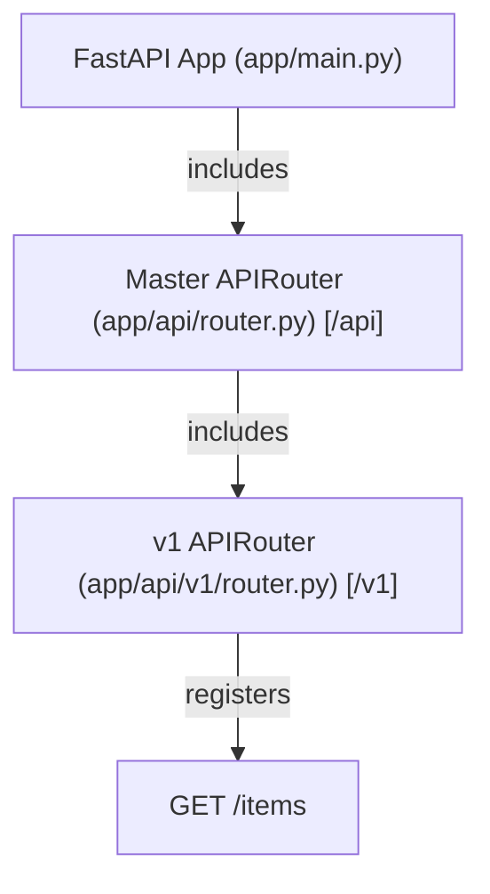
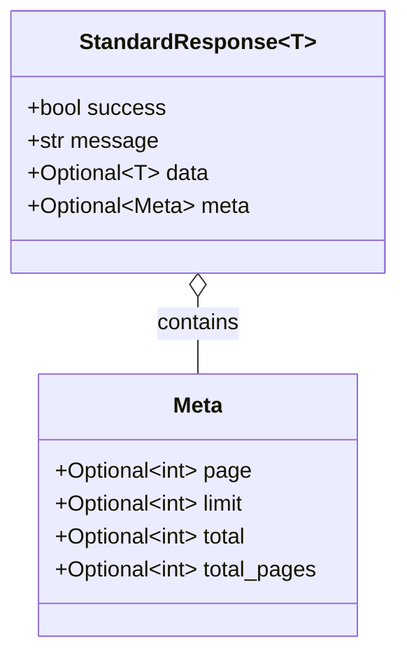
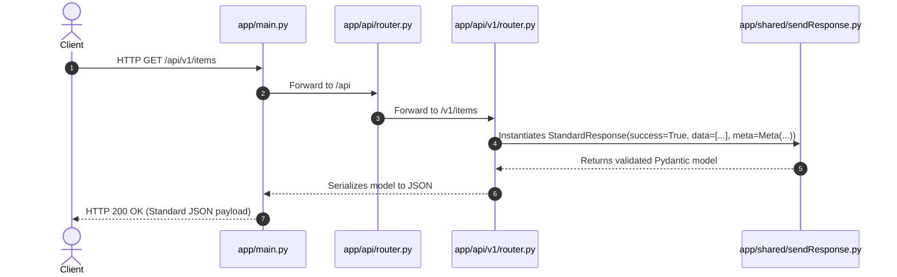

# Architecture & Design Overview

This document describes the architectural principles, directory layout, design patterns, and request lifecycle of the **Expense Tracker API**.

---

## Architecture Principles

1. **Modular & Layered Structure**: Separation of concerns across API routing, shared generic utilities, configuration, and data models.
2. **Versioned API Design**: Decoupled routing enabling seamless backward-compatible versioning (`/api/v1`, `/api/v2`).
3. **Standardized Communication Contract**: Uniform JSON response schema enforced across all endpoints via generic Pydantic generic types.
4. **Environment Isolation**: Strict configuration isolation loading settings (`PORT`, environment secrets) dynamically from `.env`.

---

## Application Directory Topology

```text
.
├── .env                  # Local environment configuration
├── .env.example          # Environment blueprint
├── README.md             # Project primary document
├── requirements.txt      # Python dependencies manifest
├── docs/                 # Extended project documentation suite
│   ├── API_DOCUMENTATION.md
│   ├── ARCHITECTURE.md
│   └── SETUP_GUIDE.md
└── app/                  # Main Python package
    ├── __init__.py       # Top-level package marker
    ├── config.py         # Dynamic environment variable loader (.env)
    ├── main.py           # Application initializer & Uvicorn runner
    ├── api/              # API routing layer
    │   ├── __init__.py   # Package marker
    │   ├── router.py     # Master APIRouter (mounted at /api)
    │   └── v1/           # API version 1 module
    │       ├── __init__.py # Package marker
    │       └── router.py # v1 router aggregator (mounted at /v1)
    ├── core/             # Core application logic & settings
    │   └── __init__.py   # Package marker
    ├── models/           # Domain schemas & database models
    │   └── __init__.py   # Package marker
    └── shared/           # Cross-cutting concerns & shared helpers
        ├── __init__.py   # Package marker
        └── sendResponse.py # Generic Pydantic response models
```

---

## Key Design Patterns

### 1. Master & Versioned Router Aggregation

The routing hierarchy uses hierarchical `APIRouter` composition:



- **Root App** includes `api_router` mounted under `/api`.
- **`app/api/router.py`** aggregates versioned routers like `v1_router` under `/v1`.
- **Resulting Endpoint Path**: `/api/v1/items`.

---

### 2. Standardized Response Model Pattern

All endpoints construct and return responses using `StandardResponse[T]` defined in [`app/shared/sendResponse.py`](../app/shared/sendResponse.py).



#### Rationale:
- Enforces consistency across front-end integration.
- Supports generic typed payloads (`T`).
- Easily includes standardized pagination metadata (`Meta`) without altering API signatures.

---

## Request & Execution Lifecycle



---

## Extensibility & Scalability Roadmap

1. **Adding API v2**:
   Simply create `app/api/v2/router.py` and include it in `app/api/router.py` with `prefix="/v2"`.
2. **Database Integration**:
   Integrate ORM database engines (e.g. SQLAlchemy or SQLModel) inside `app/models/` and manage DB connections inside `app/core/`.
3. **Authentication Layer**:
   Add JWT authentication middleware or FastAPI dependencies inside `app/core/security.py`.
