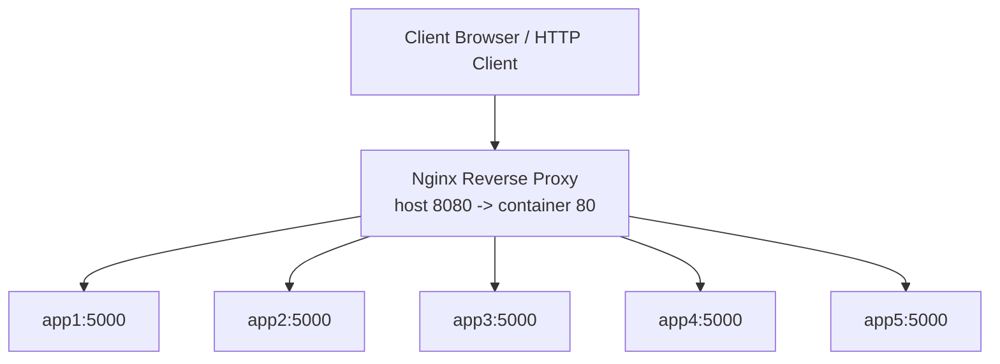
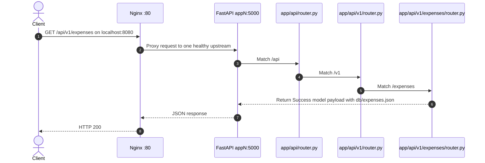
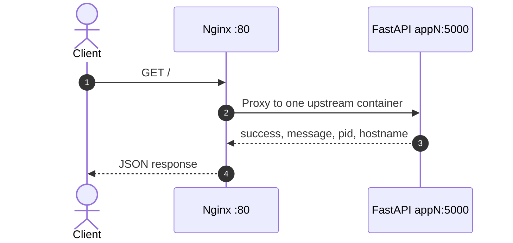
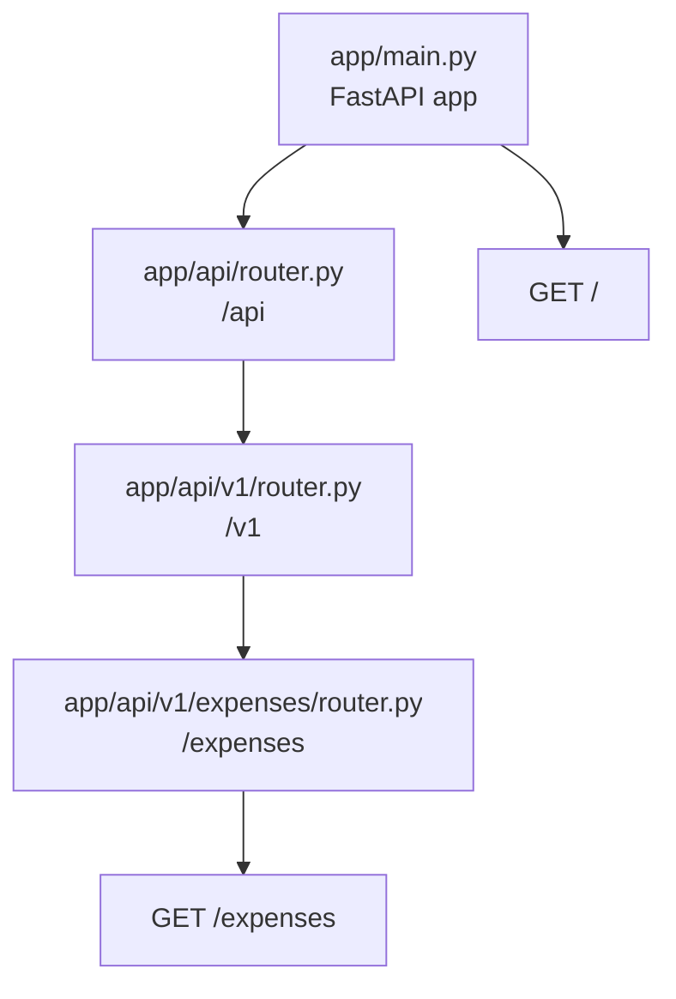

# Architecture & Design Overview

This document describes the current architecture of the Expense Tracker API, including the FastAPI application, Docker Compose runtime, and Nginx load balancer.

---

## Architecture Principles

1. **Modular routing**: API routes are grouped through FastAPI `APIRouter` modules.
2. **Versioned APIs**: Current public API routes live under `/api/v1`.
3. **Standard responses**: API endpoints use a shared response contract where appropriate.
4. **Environment-based configuration**: `PORT` is read from the environment and defaults to `5000`.
5. **Container-first runtime**: Docker Compose runs five FastAPI app containers behind Nginx.
6. **Private app network**: FastAPI containers do not publish port `5000` to the host.

---

## Runtime Architecture



Nginx communicates with `app1` through `app5` using Docker's internal DNS on the `backend` network.

---

## Docker Networking

The Compose stack defines one bridge network:

```yaml
networks:
  backend:
    driver: bridge
```

Every FastAPI container and the Nginx container joins this network. Nginx can resolve app containers by service name:

```nginx
server app1:5000;
server app2:5000;
server app3:5000;
server app4:5000;
server app5:5000;
```

Only Nginx is exposed to the host:

```yaml
ports:
  - "8080:80"
```

FastAPI services use `expose: "5000"`, which documents the internal port without publishing it to the host.

---

## Nginx Load Balancing

The upstream uses `least_conn`:

```nginx
upstream expense_tracker_api {
    least_conn;
    server app1:5000;
    server app2:5000;
    server app3:5000;
    server app4:5000;
    server app5:5000;
}
```

`least_conn` sends each request to the upstream container with the fewest active connections. For light manual browser refreshes, distribution may not appear perfectly round-robin, but repeated requests should show traffic reaching all five containers.

---

## Request Lifecycle



For the root diagnostic endpoint:



---

## Application Routing



Final endpoint paths:

```text
GET /
GET /api/v1/expenses
```

---

## Health Checks

Each app service runs a Docker health check against:

```text
http://127.0.0.1:5000/
```

Nginx has `depends_on` conditions so it starts after the five FastAPI services become healthy.

---

## Root Diagnostic Response

The root endpoint returns instance metadata:

```json
{
  "success": true,
  "message": "Hello, World!",
  "instance": {
    "pid": 1,
    "hostname": "container-id"
  }
}
```

This response is intentionally not wrapped in `StandardResponse`; it exists to verify which container handled a request.

---

## Extension Plan

Recommended future structure for domain modules:

```text
app/api/v1/
├── auth/
│   ├── routes.py
│   ├── schemas.py
│   └── service.py
├── users/
│   ├── routes.py
│   ├── schemas.py
│   └── service.py
└── router.py
```

Keep HTTP concerns in `routes.py`, validation models in `schemas.py`, and business logic in `service.py`.
