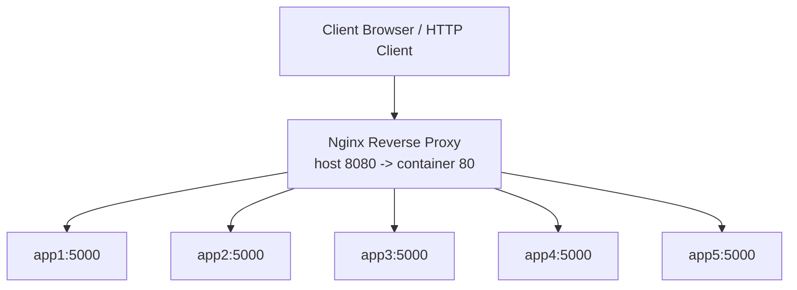
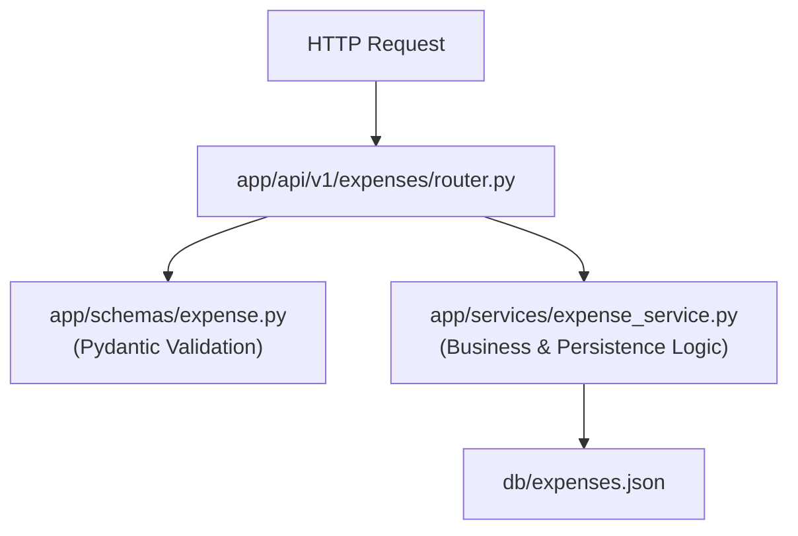

# Architecture & Design Overview

This document describes the architecture of the Expense Tracker API, including the FastAPI application, Pydantic validation schemas, service layer persistence, Docker Compose runtime, and Nginx load balancer.

---

## Architecture Principles

1. **Layered Architecture**: Separation of concerns between HTTP routes (`app/api`), Pydantic validation (`app/schemas`), and business/storage logic (`app/services`).
2. **Modular Routing**: API routes are grouped through FastAPI `APIRouter` modules.
3. **Versioned APIs**: Current public API routes live under `/api/v1`.
4. **Strict Schema Validation**: Request and response payloads are validated using Pydantic V2 models.
5. **Standard Responses**: API endpoints use a shared response contract (`Success`, `Error`, `Meta`).
6. **Environment-Based Configuration**: `PORT` is read from the environment and defaults to `5000`.
7. **Container-First Runtime**: Docker Compose runs five FastAPI app containers behind Nginx.
8. **Private App Network**: FastAPI containers do not publish port `5000` to the host.

---

## Runtime Architecture



Nginx communicates with `app1` through `app5` using Docker's internal DNS on the `backend` network.

---

## Application Layering



- **Router Layer**: Parses path/query params, invokes schemas for validation, calls service methods, and wraps responses in `Success` payload objects.
- **Schema Layer**: Defines `ExpenseCreate`, `ExpenseUpdate`, and `ExpenseResponse`.
  - Automatically generates `date` (`YYYY-MM-DD`) if omitted on creation.
  - Enforces minimum 1 field payload condition on update operations.
- **Service Layer**: Handles ID generation (`E001`, `E002`), filtering/sorting algorithms, and thread-safe read/write operations to `db/expenses.json`.

---

## Docker Networking

The Compose stack defines one bridge network:

```yaml
networks:
  backend:
    driver: bridge
```

Every FastAPI container and the Nginx container joins this network. Nginx can resolve app containers by service name:

```nginx
server app1:5000;
server app2:5000;
server app3:5000;
server app4:5000;
server app5:5000;
```

Only Nginx is exposed to the host:

```yaml
ports:
  - "8080:80"
```

FastAPI services use `expose: "5000"`, which documents the internal port without publishing it to the host.

---

## Nginx Load Balancing

The upstream uses `least_conn`:

```nginx
upstream expense_tracker_api {
    least_conn;
    server app1:5000;
    server app2:5000;
    server app3:5000;
    server app4:5000;
    server app5:5000;
}
```

`least_conn` sends each request to the upstream container with the fewest active connections.

---

## Extension Plan

Recommended structure for future domain modules (e.g., `categories`, `users`):

```text
app/
├── schemas/
│   ├── expense.py
│   ├── category.py
│   └── user.py
├── services/
│   ├── expense_service.py
│   ├── category_service.py
│   └── user_service.py
└── api/
    └── v1/
        ├── expenses/
        │   └── router.py
        ├── categories/
        │   └── router.py
        └── router.py
```

Keep HTTP concerns in `router.py`, validation models in `app/schemas/`, and data persistence in `app/services/`.
